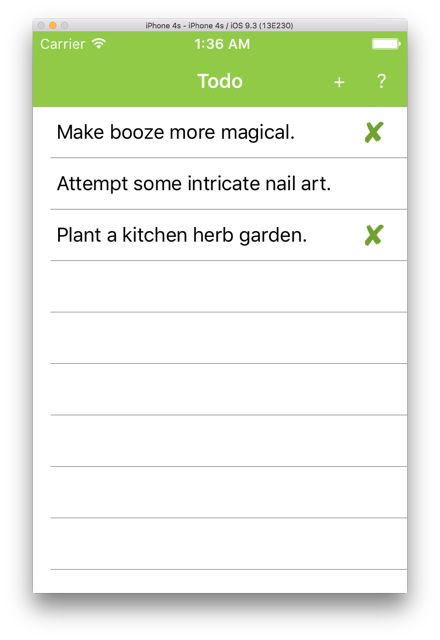

## ตัวอย่างการใช้ฐานข้อมูล Realm



## โครงสร้างโปรเจค

```
└── TodoPcl
    ├── Todo
    │   ├── App.cs
    │   ├── Data
    │   │   └── TodoItemDatabase.cs
    │   ├── ITextToSpeech.cs
    │   ├── Models
    │   │   └── TodoItem.cs
    │   ├── Properties
    │   │   └── AssemblyInfo.cs
    │   ├── Toolkit.Content
    │   └── Views
    │       ├── TodoItemListX.xaml
    │       ├── TodoItemListX.xaml.cs
    │       ├── TodoItemPageX.xaml
    │       └── TodoItemPageX.xaml.cs
    └── Todo.iOS
        ├── AppDelegate.cs
        ├── CustomerRenders
        │   └── BorderlessEntryRenderer.cs
        ├── Main.cs
        ├── Resources
        └── TextToSpeech_iOS.cs
```

## ไฟล์ TodoItemDatabase.cs

- สร้าง Repository ผ่าน Realm.GetInstance()
- เพิ่ม/ลบ/แก้ไข ข้อมูลผ่าน Block realm.BeginWrite()

```csharp
public class TodoItemDatabase {
    Realm realm;
    public TodoItemDatabase() {
        realm = Realm.GetInstance();
    }

    public IEnumerable<TodoItem> GetItems() {
        return realm.All<TodoItem>().ToList();
    }

    public IEnumerable<TodoItem> GetItemsNotDone() {
        return realm.All<TodoItem>().Where(x => x.Done == false).ToList();
    }

    public TodoItem GetItem(string id) {
        return realm.All<TodoItem>() .ToList() .FirstOrDefault(x => x.ID == id);
    }

    public string SaveItem(TodoItem item) {
        var newItem = realm.All<TodoItem>() .ToList() .FirstOrDefault(x => x.ID == item.ID);
        using (var trans = realm.BeginWrite()) {
            if (newItem == null) {
                newItem = realm.CreateObject<TodoItem>();
                newItem.ID = Guid.NewGuid().ToString();
            }
            newItem.Name = item.Name;
            newItem.Notes = item.Notes;
            newItem.Done = item.Done;
            trans.Commit();
        }
        return newItem?.ID;
    }

    public string DeleteItem(string id) {
        var item = realm.All<TodoItem>() .ToList() .FirstOrDefault(x => x.ID == id);
        if (item == null) return null;
        using (var trans = realm.BeginWrite()) {
            realm.Remove(item);
            trans.Commit();
        }
        return id;
    }
}
```

## Xamarin Todo with Realm

Xamarin.Formsの [Todoサンプル](https://developer.xamarin.com/samples/xamarin-forms/Todo/) をSQLite仕様から [Realm Xamarin](https://realm.io/docs/xamarin/latest/) 仕様に置き換えたもの。

## サンプルの改造点

各プロジェクトでNuGetパッケージを追加、更新。
(Xamarin.Forms 2.2.0、Realm 0.74.1)

PCLプロジェクトを修正。

**TodoItem.cs**

SQLite版ではIDプロパティをオートインクリメントにしていますが、現時点ではRealmがオートインクリメントに対応していないそうなので、intからstringに変更してGUIDを使うことにしました。

**TodoItemDatabase.cs**

基本的にSQLite DBの操作をRealmに置き換え。

ただし、現時点ではRealmへのLinqクエリでWherer等のサポートが不完全なため、いったんToList()してから改めてフィルタリングしています。

**App.cs**

TodoItem.IDをstring型に変更した関係でApp.csも一部修正。

**Views/TodoItemListX.xaml.cs**

SQLite版を踏襲すると  TodoItemListX.xaml.csでTodo編集ページのBindingContextにTodoItemを渡すことになります。
そのまままでは、双方向BindingでプロパティSetterが呼ばれて死ぬので一工夫必要です。
(Realmが管理中のRealmObjectはトランザクション外での編集禁止)

今回は編集用のコピーを作ってBindingContextにセットしています。


## 元のTodoサンプルのライセンス

> The Apache License 2.0 applies to all samples in this repository.
>
> Copyright 2011 Xamarin Inc
>
> Licensed under the Apache License, Version 2.0 (the "License"); you may not use this file except in compliance with the License. You may obtain a copy of the License at
>
> >   http://www.apache.org/licenses/LICENSE-2.0
>
> Unless required by applicable law or agreed to in writing, software distributed under the License is distributed on an "AS IS" BASIS, WITHOUT WARRANTIES OR CONDITIONS OF ANY KIND, either express or implied. See the License for the specific language governing permissions and limitations under the License.


